# 🚀 DevOps Project 2 + 3 — Agentic AI on AWS EKS with Full CI/CD Pipeline

> **Built by Aravind Boopathy** | DevOps Engineer | Ex-Capgemini  
> Azure (AZ-104) | Terraform | Kubernetes | AWS EKS | ArgoCD | Agentic AI

---

## 🎯 What Makes This Different

Most DevOps pipelines need a human to:
- Notice when something breaks
- SSH into the cluster to investigate
- Run kubectl commands manually
- Figure out the root cause
- Fix it

**This pipeline does all of that automatically.**

A pod crashes at 3am → Prometheus detects it → AI diagnoses the exact root cause → fixes it → reports to Slack. Nobody woke up.

Want to check your cluster? Just ask in Slack:
> *"how many pods are running?"* → AI checks EKS and explains in plain English  
> *"scale to 3 pods"* → It actually does it  
> *"is my app healthy?"* → Real pod status, no kubectl needed

**This is Conversational DevOps — managing infrastructure through natural language.**

---

## 🏗️ Architecture Overview

```
Developer Push (GitHub)
        │
        ▼
┌──────────────────────────────┐
│      GitHub Actions          │  ← CI/CD triggers on push to main
│      CI/CD Pipeline          │
│      ✅ Success in 2m 18s    │
└──────────────┬───────────────┘
               │
    ┌──────────┴────────────────────────────────┐
    │                                           │
    ▼                                           ▼
Maven Build + SonarQube                  Docker Build + Trivy Scan
OWASP Dependency Check                   Push to AWS ECR
    │                                           │
    └──────────────────┬────────────────────────┘
                       │
                       ▼
             Update K8s Manifest Repo
             (devops-k8s-manifest)
                       │
                       ▼
┌──────────────────────────────────┐
│         ArgoCD v3.4.3            │  ← GitOps: watches manifest repo
│   Status: ✅ Healthy + Synced    │
│   App: devops-app                │
│   Namespace: default             │
└──────────────┬───────────────────┘
               │
               ▼
┌──────────────────────────────────┐
│       AWS EKS Cluster            │  ← ap-south-1 (Mumbai)
│       3x t3.small nodes          │
│                                  │
│  Namespaces:                     │
│  ├── default (devops-app) ✅     │
│  ├── argocd (7 pods) ✅          │
│  ├── monitoring (6 pods) ✅      │
│  └── kube-system (8 pods) ✅     │
└──────────────┬───────────────────┘
               │
               ▼
┌──────────────────────────────────┐
│   Prometheus + Grafana           │  ← Real-time cluster monitoring
│   CPU Utilisation: 1.58%         │
│   Memory Utilisation: 40.1%      │
│   Namespaces monitored: 4        │
└──────────────┬───────────────────┘
               │
               ▼
┌──────────────────────────────────┐
│      Agentic AI Layer            │  ← 3 AI Agents on AWS Lambda
│   Agent 1: Failure Analyzer      │
│   Agent 2: Slack K8s Bot         │
│   Agent 3: Auto-Healer           │
└──────────────────────────────────┘
```

---

## 🛠️ Tech Stack

| Category | Tool | Details |
|----------|------|---------|
| Cloud | AWS | EKS, ECR, Lambda, API Gateway |
| Region | ap-south-1 | Mumbai |
| CI/CD | GitHub Actions | Triggers on push to main |
| GitOps | ArgoCD v3.4.3 | Auto-sync from manifest repo |
| Container | Docker | Pushed to AWS ECR |
| Kubernetes | AWS EKS | 3x t3.small nodes |
| Code Quality | SonarQube | Running on EC2 port 9000 |
| Security | OWASP + Trivy | Dependency + image scanning |
| Monitoring | Prometheus + Grafana | Helm installed on EKS |
| AI Brain | Groq (Llama 3.3 70B) | Free, fast inference |
| AI Runtime | AWS Lambda | 3 separate functions |
| Notifications | Slack | #devops channel |
| IaC | eksctl + Helm | Cluster + monitoring setup |

---

## 🔄 CI/CD Pipeline — GitHub Actions

The pipeline triggers automatically on every push to `main` branch.

| Step | Action |
|------|--------|
| ✅ Checkout code | Pull latest from GitHub |
| ✅ Setup Java 17 | Temurin distribution |
| ✅ Maven build | `mvn clean package` |
| ✅ SonarQube scan | Code quality analysis |
| ✅ OWASP check | Dependency vulnerability scan |
| ✅ Configure AWS credentials | IAM user authentication |
| ✅ Login to ECR | AWS container registry |
| ✅ Build Docker image | Tagged with run number |
| ✅ Trivy scan | Container security scan |
| ✅ Push to ECR | Image stored in AWS ECR |
| ✅ Update manifest repo | Triggers ArgoCD sync |
| ✅ Slack notification | Success/failure alert |

**Total pipeline time: 2 minutes 18 seconds ⚡**

---

## 🐙 ArgoCD — GitOps Deployment

| Property | Value |
|----------|-------|
| Application Name | devops-app |
| Status | ✅ Healthy + Synced |
| Repository | github.com/aravindboopathy99-debug/devops-k8s-manifest |
| Target Revision | main |
| Destination | in-cluster |
| Namespace | default |
| Sync Policy | Automated + Self-Heal + Prune |

---

## ☸️ Kubernetes Cluster — All Pods Running

```
NAMESPACE     NAME                                          STATUS
argocd        argocd-application-controller-0              ✅ Running
argocd        argocd-applicationset-controller             ✅ Running
argocd        argocd-dex-server                            ✅ Running
argocd        argocd-notifications-controller              ✅ Running
argocd        argocd-redis                                 ✅ Running
argocd        argocd-repo-server                           ✅ Running
argocd        argocd-server                                ✅ Running
default       devops-app (2 replicas)                      ✅ Running
kube-system   aws-node (x3)                                ✅ Running
kube-system   coredns (x2)                                 ✅ Running
kube-system   kube-proxy (x3)                              ✅ Running
kube-system   metrics-server (x2)                          ✅ Running
monitoring    alertmanager                                  ✅ Running
monitoring    grafana                                       ✅ Running
monitoring    kube-prometheus-operator                      ✅ Running
monitoring    kube-state-metrics                            ✅ Running
monitoring    node-exporter (x3)                            ✅ Running
monitoring    prometheus                                    ✅ Running
```

**Total: 24 pods — all Running ✅**

---

## 📊 Prometheus + Grafana Monitoring

| Metric | Value |
|--------|-------|
| CPU Utilisation | 1.58% |
| Memory Utilisation | 40.1% |
| CPU Requests Commitment | 14.7% |
| Namespaces Monitored | 4 (argocd, default, kube-system, monitoring) |
| Dashboard | Kubernetes / Compute Resources / Cluster |
| Refresh Rate | Every 10 seconds |

---

## 🔑 GitHub Secrets Configured

```
AWS_ACCESS_KEY_ID        ✅
AWS_SECRET_ACCESS_KEY    ✅
AWS_REGION               ✅  ap-south-1
AWS_ACCOUNT_ID           ✅  120700269210
ECR_REPOSITORY           ✅  devops-app
MANIFEST_REPO_TOKEN      ✅
SONAR_HOST_URL           ✅  http://EC2_IP:9000
SONAR_TOKEN              ✅
SLACK_WEBHOOK_URL        ✅
```

---

## 🤖 Project 3 — Agentic AI DevOps

### Agent 1 — Pipeline Failure Analyzer

```
Pipeline fails
      ↓
GitHub Actions calls Lambda (ai-devops-agent)
      ↓
AI reads the error logs and run ID
      ↓
Diagnoses root cause in seconds
      ↓
Posts full analysis to Slack
```

### Agent 2 — Conversational Kubernetes Bot

| You ask in Slack | What happens |
|-----------------|--------------|
| `"how many pods are running?"` | Runs kubectl, AI explains output |
| `"is my app healthy?"` | Checks pod status, reports in plain English |
| `"scale to 3 pods"` | Actually runs `kubectl scale deployment/devops-app --replicas=3` |
| `"show me app logs"` | Fetches logs, AI explains what it sees |
| `"rollback app"` | Runs `kubectl rollout undo` |

### Agent 3 — Auto-Healing Agent

```
Pod crashes (CrashLoopBackOff / OOMKilled)
      ↓
Prometheus alert rule fires
      ↓
Alertmanager webhook → API Gateway → Lambda
      ↓
AI diagnoses exact root cause
      ↓
Executes fix if safe, skips if not
      ↓
Full analysis posted to Slack automatically
```

---

## 📸 Screenshots

**GitHub Actions — Pipeline Success**
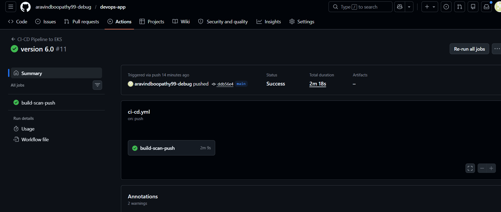

**GitHub Actions — All Workflow Runs**
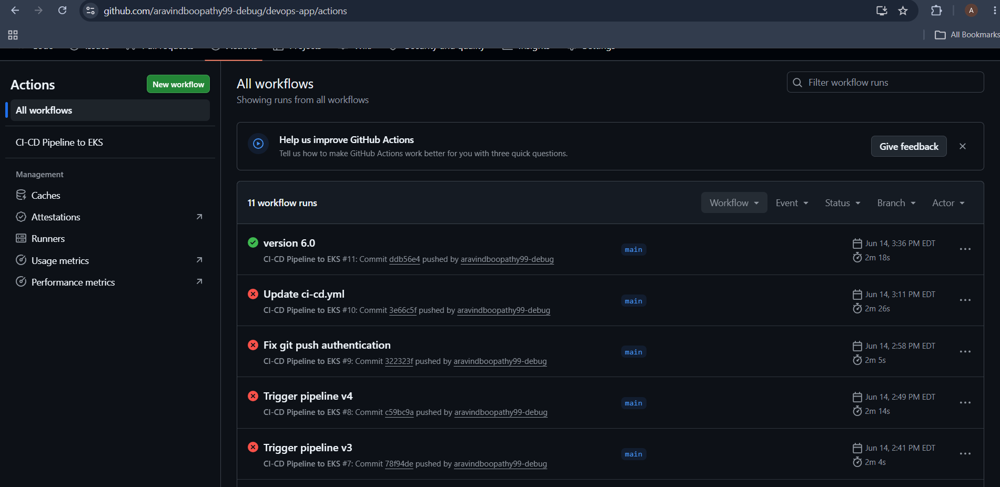

**GitHub Secrets Configured**
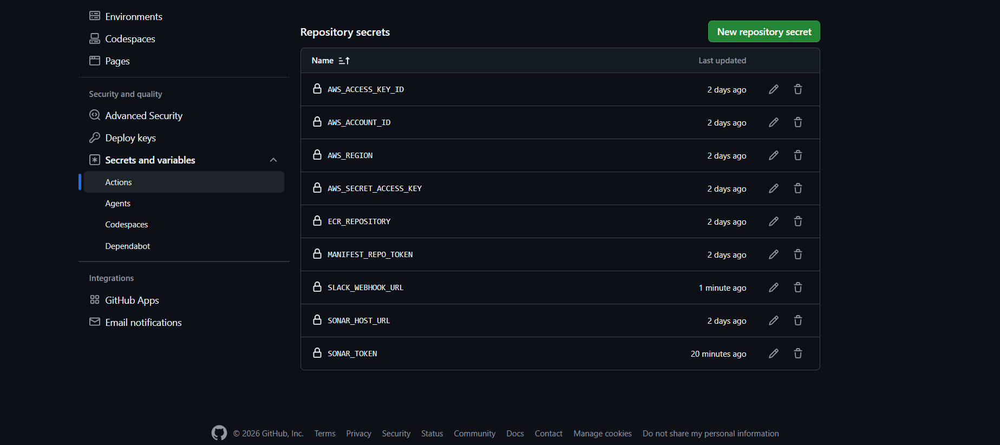

**AWS ECR — Docker Images**
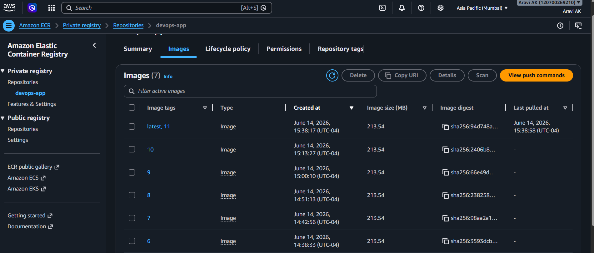

**EKS Nodes Ready + Tools Installed**
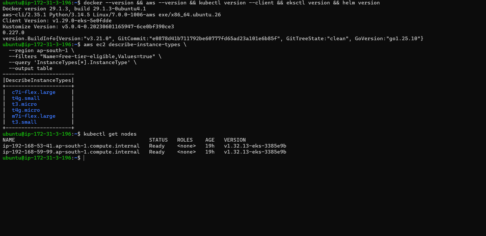

**Kubernetes All Pods Running**
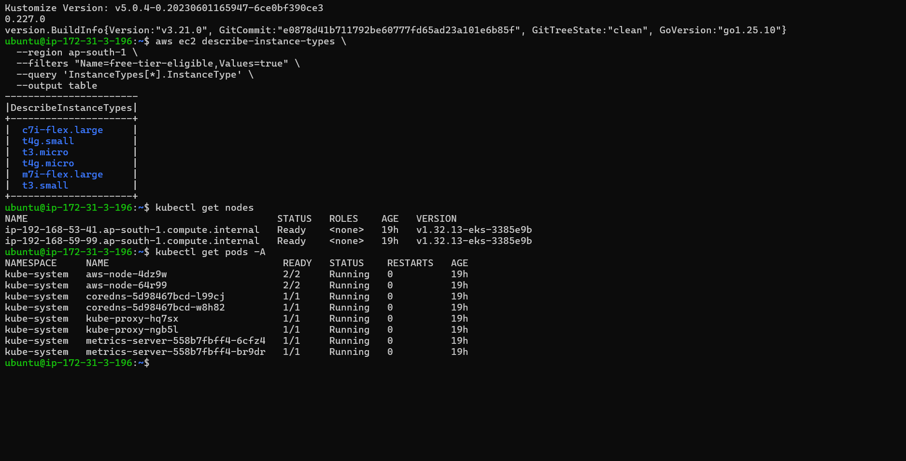

**ArgoCD — Healthy & Synced**
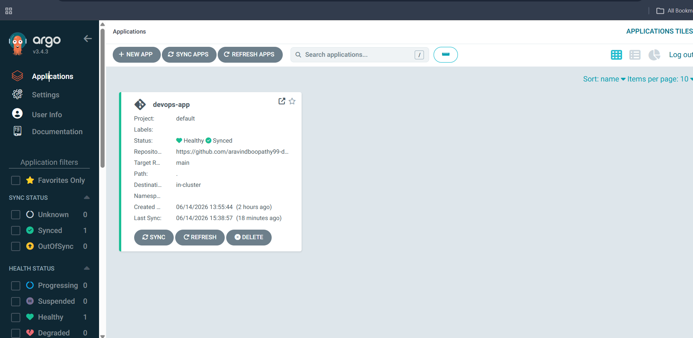

**Kubernetes Pods + LoadBalancer Service**
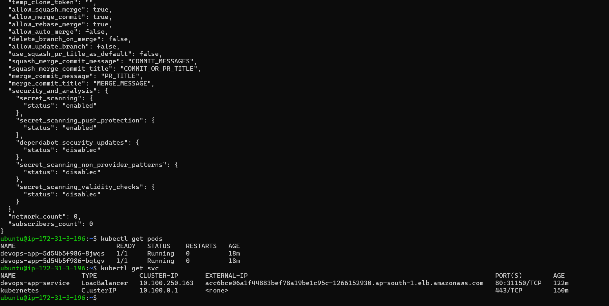

**App Live on AWS Load Balancer**
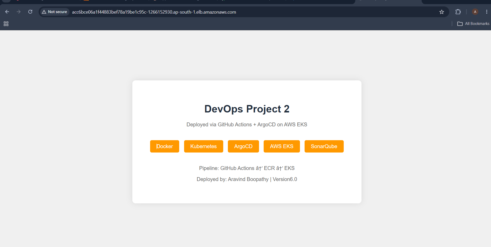

**Slack — Pipeline Notifications**
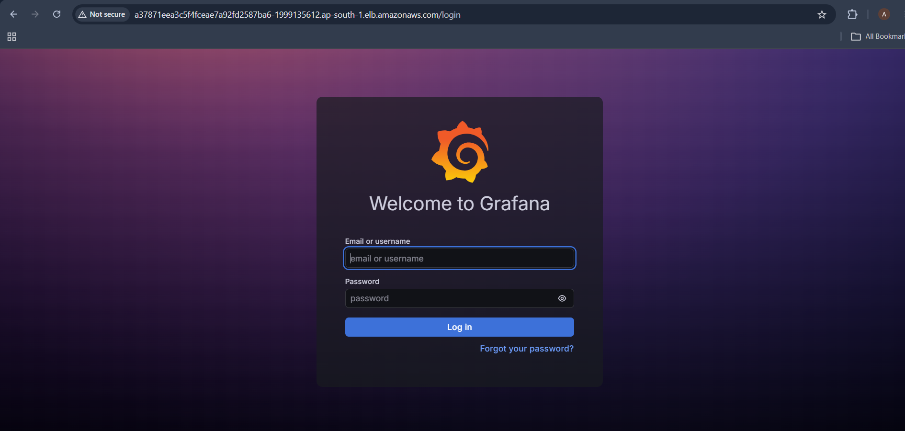

**Grafana — Kubernetes Cluster Monitoring**
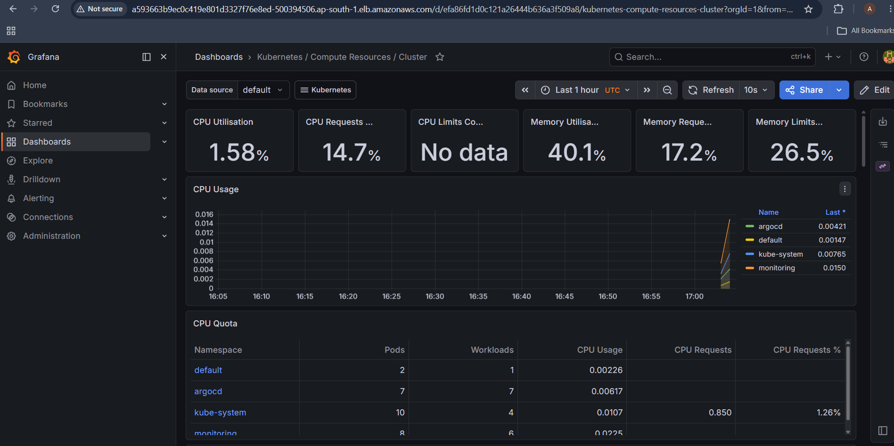

**AI Agent — Pipeline Failure Analysis**
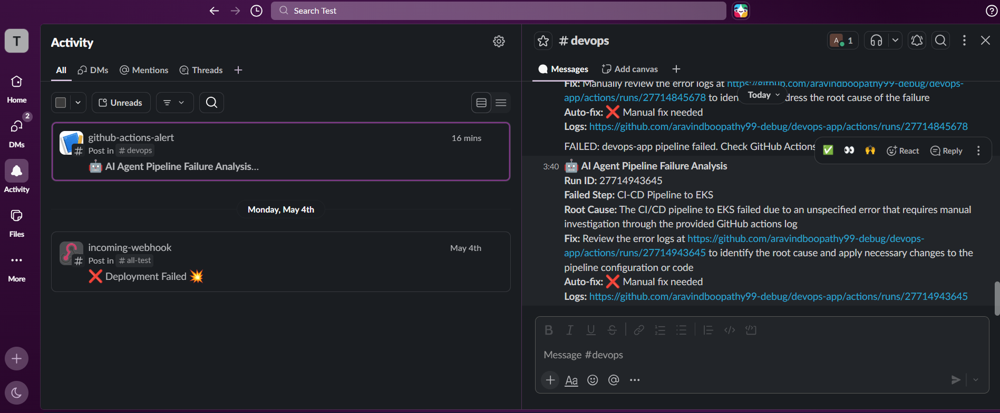

**Slack Bot — Pod Status Check**
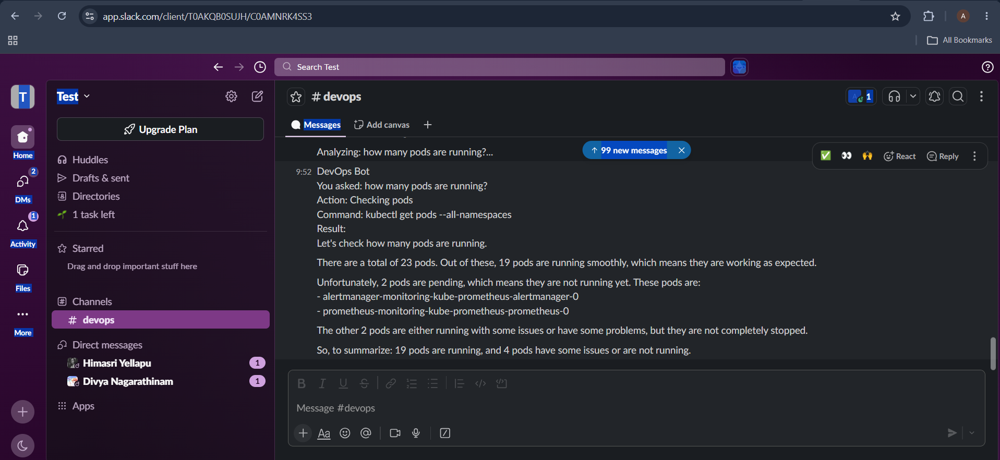

**Slack Bot — App Health Check**
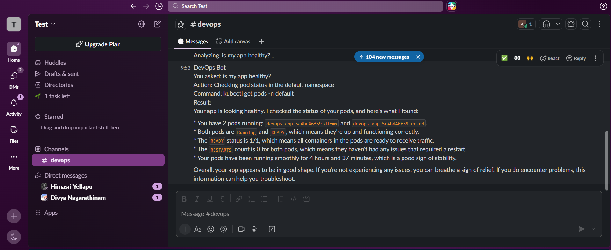

**Slack Bot — Scale Deployment**
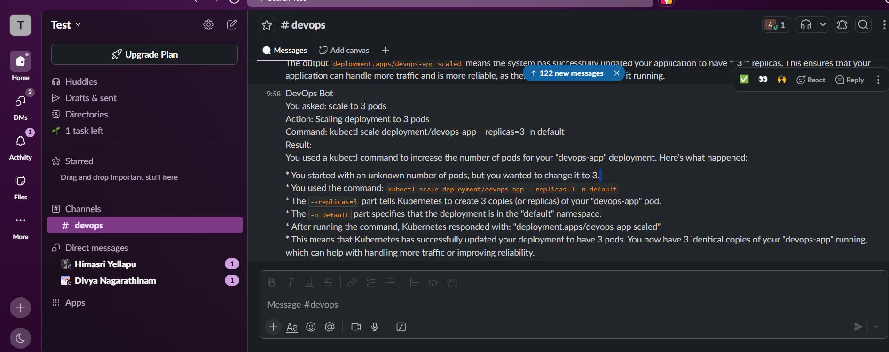

**Slack Bot — App Logs**
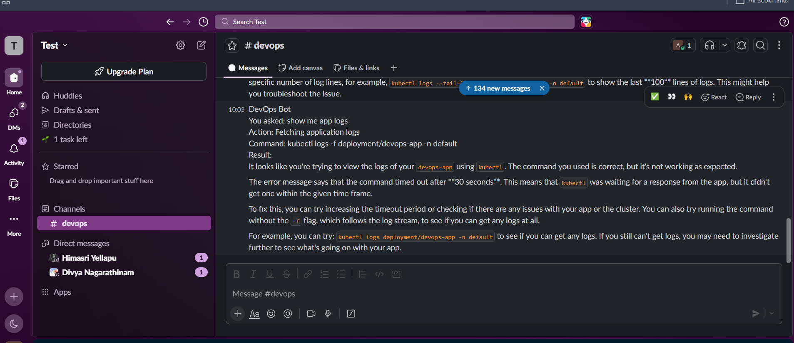

**Auto-Heal Agent — Pod Crash Detected + AI Diagnosis**
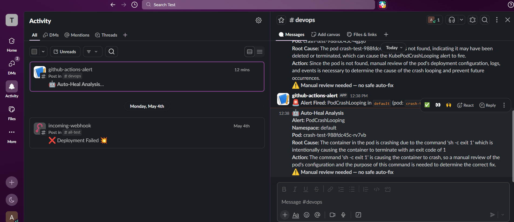

---

## 🔗 Related Repositories

| Repo | Purpose |
|------|---------|
| [devops-app](https://github.com/aravindboopathy99-debug/devops-app) | Application code + CI/CD pipeline |
| [devops-k8s-manifest](https://github.com/aravindboopathy99-debug/devops-k8s-manifest) | Kubernetes manifests (GitOps) |

---

## 📊 Results

- ✅ Full CI/CD pipeline running (image tag 17+, 2m 18s total)
- ✅ App deployed on AWS EKS via GitOps (ArgoCD)
- ✅ Real-time monitoring with Prometheus + Grafana
- ✅ AI agent analyzing pipeline failures automatically
- ✅ Slack bot controlling Kubernetes in plain English
- ✅ Auto-healing detecting and diagnosing pod crashes
- ✅ Fixed a real 2-day-old ArgoCD CRD bug during development

---

## 👤 Author

**Aravind Boopathy**  
DevOps Engineer | Open to Work  
📍 Guelph, Ontario, Canada  
🔗 [LinkedIn](https://linkedin.com/in/aravind-boopathy-19049337a)  
🐙 [GitHub](https://github.com/aravindboopathy99-debug)

*Certifications: Microsoft Azure Administrator (AZ-104) | HashiCorp Terraform Associate (003)*
